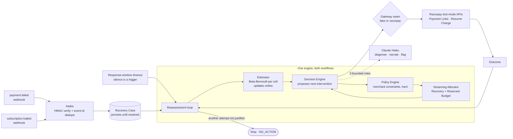

# Razorpay Revenue Recovery

**An AI agent that works a failed payment or a halted subscription as a case over time** — it
re-estimates the odds and economics of recovery on every cycle, proposes the next
merchant-approved intervention, watches the outcome, escalates when a human should look, and
**stops when spending more is no longer justified**. It executes through real Razorpay test-mode
APIs and measures the *incremental* net revenue it recovered against honest baselines.

`Track 3 · AI Revenue Recovery`  ·  `Razorpay Buildathon 2026`  ·  `▶ 5-min pitch video: TODO — add unlisted link`  ·  `🌐 Live demo: https://recovery-demo-nkxn.onrender.com`

> The live demo is a **read-only replay** on the deterministic fake gateway (no keys,
> re-seeded on every boot). The full agent loop — live reassessment and the human-in-the-loop
> handoff — is in the video and on a local run ([ADR-0015](docs/adr/0015-hosted-demo-deployment.md)).

> Solo build, ~15 days. The reasoning behind every non-obvious decision lives in
> [`docs/adr/`](docs/adr/) (15 ADRs) and the domain vocabulary in [`CONTEXT.md`](CONTEXT.md).
> This README is the front door; those are the primary sources.

---

## The problem

A merchant on Razorpay loses revenue that was already in motion at two reactive moments: a
**payment fails at checkout**, or a **subscription exhausts Razorpay's own three automatic
retries** and is marked `halted`. Today, recovering that money is either fully manual (someone
notices and follows up) or doesn't happen — nobody reviews every failed payment and decides,
case by case, whether it's worth a retry, a payment link, a discount, or nothing.

"A chatbot that offers a coupon" is not the answer either:

- **Not every case deserves the same intervention.** A loyal customer with an expired card is
  not a chronic failed payer, and shouldn't get the same treatment.
- **Incentive spend has to be bounded.** Every discount competes against every other case for
  one shared budget, and the good cases haven't all arrived yet when you're deciding on this one.
- **A merchant needs to trust *why*.** "The AI did something" is not good enough for money — every
  decision, rejection, and stop has to be on an audit trail.

So the unit of work here is not a recommendation. It's a **Recovery Case** that persists from
detection to resolution and gets reassessed until it recovers or is deliberately stopped.

---

## What it does

1. **Detects** — verifies a Razorpay `payment.failed` or `subscription.halted` webhook (HMAC-SHA256
   over the raw body), deduplicates by `x-razorpay-event-id`, and opens exactly one Recovery Case.
2. **Reassesses** — on every real webhook outcome *and* whenever a Response Window elapses with no
   outcome. Silence is a trigger, not an absence of one ([ADR-0005](docs/adr/0005-hybrid-reassessment-trigger.md)).
3. **Estimates** — recovery probability comes from a Beta-Bernoulli posterior per
   `(failure_reason × customer_segment_proxy × intervention)` cell, updated online. Never an LLM
   guess ([ADR-0006](docs/adr/0006-decision-engine-estimator.md)).
4. **Decides & validates** — the Decision Engine proposes the next intervention (retry, payment
   link, incentive, escalate, or `NO_ACTION`); the deterministic Policy Engine validates it
   against merchant constraints *before anything touches money* and records any rejection.
5. **Allocates** — a streaming allocator funds the incentive against a Recovery Budget while
   holding back a Reserved Budget for better cases still to arrive ([ADR-0003](docs/adr/0003-streaming-allocation.md)).
6. **Executes** — through one Gateway seam that is either the in-process fake or real Razorpay
   test-mode APIs (Payment Links, Resume Charge), chosen by config alone.
7. **Stops** — when the expected value of another attempt no longer clears its cost. `NO_ACTION`
   (including "stop entirely") is a real, auditable decision.

The incentive-response model is **static by design** — a flat uplift when an incentive is funded.
This system does **not** learn discount sensitivity online; that's deliberately deferred
([ADR-0014](docs/adr/0014-flat-incentive-response-learnable-deferred.md)). Nothing in the demo or
these numbers should be read as a learning claim.

**The pitch video walks through:** a live case timeline (detected → decision + reasoning → policy
check naming the binding constraint → execution → webhook → reassessment → stop); the budget
reserve declining then spending on a better later case; a `NO_ACTION` case that recovered anyway;
one policy rejection and one escalation with a human override; aggregate NRR vs two baselines
with an interval and % of offline-optimal; the calibration curve.

---

## Quickstart (no credentials needed)

The default gateway is a deterministic in-process fake and the LLM falls back to a deterministic
double when no API key is set — so the whole thing runs, seeded, with **no Razorpay account and
no Anthropic key**.

**Prerequisites:** Python 3.13 + [`uv`](https://docs.astral.sh/uv/), Node 20+ with npm.

```bash
# 1. backend — API + seeded demo data
cd backend
cp ../.env.example ../.env            # defaults are fine; GATEWAY_BACKEND=fake
uv run python -m app.demo_seed        # writes ./recovery.db
uv run uvicorn app.main:app --port 8000

# 2. frontend — in a second terminal
cd frontend
npm install
npm run dev                          # http://localhost:5173
```

Open <http://localhost:5173>. Four tabs: **Case Timeline**, **Reserved Budget**, **Evaluation**,
**Escalations**. Backend health check at <http://localhost:8000/health>. The dev server proxies
the API prefixes to `:8000`, so the SPA calls same-origin paths and needs no `VITE_API_BASE_URL`
([ADR-0015](docs/adr/0015-hosted-demo-deployment.md) one-port collapse).

**Tests:** `cd backend && uv run pytest` (251 tests). **Frontend check:** `cd frontend && npm run build && npm run lint`.

<details>
<summary>Run it as one container (install nothing but Docker)</summary>

```bash
docker build -t recovery-demo .
docker run --rm -p 8000:8000 recovery-demo
```

Open <http://localhost:8000> — one process serves the built SPA and the API. The image runs the
fake gateway with no keys, re-seeds an ephemeral SQLite DB on start, disables the sweep, and runs
read-only (`DEMO_READONLY=true`). This is the exact unit deployed to Render; override any of the
`ENV` defaults in `Dockerfile` via `-e` or the platform dashboard. The `uv`/`npm` quickstart above
stays the primary path — this is the "install nothing" fallback.
</details>

<details>
<summary>Running against real Razorpay test mode</summary>

1. Set in `.env`: `GATEWAY_BACKEND=razorpay`, `RAZORPAY_KEY_ID`, `RAZORPAY_KEY_SECRET`,
   `RAZORPAY_WEBHOOK_SECRET`. Add `ANTHROPIC_API_KEY` to use real Claude instead of the fake.
2. Expose the local webhook endpoint: `ssh -R 80:localhost:8000 nokey@localhost.run` and
   register the resulting URL in the Razorpay dashboard (re-register each session — the URL
   changes).
3. Razorpay test-mode Payment Links are capped at 30 per business; the real-execution slice is a
   deliberately small (~20–25 case) integration proof, not where the evaluation numbers come from
   ([ADR-0007](docs/adr/0007-evaluation-integrity.md)).

Note: driving a test-mode subscription to `halted` on demand ("Charge this now → Failure" ×4) is
reproducible but finicky — see [What broke](#what-broke-and-how-we-got-out) below. The shipped
build exercises the subscription workflow through synthetic `subscription.halted` events; the
real-Razorpay halted slice **was run end-to-end on 2026-09-04** — real webhook received, HMAC
verified, case created (`source=REAL`), event-id dedupe confirmed. `resume_charge` on a genuinely
halted subscription is rejected by Razorpay (`400 "subscription can't be resumed"`), a documented
recovery-execution limit (see the research doc's Addendum 3).
</details>

---

## Architecture

Two workflows — failed payment and halted subscription — run through **one engine**. The only
thing they don't share is which subset of interventions is valid for each. Everything above the
Gateway seam is oblivious to whether it's talking to the fake or real Razorpay.



**Backend** (`backend/app/`, FastAPI + SQLModel over SQLite, managed by `uv`):

| Module | Responsibility |
|---|---|
| `intake.py`, `webhook_security.py` | Webhook verify + dedupe + case creation |
| `lifecycle.py` | Reassessment loop, Case History, fatigue, stop conditions, the scheduled sweep |
| `estimator.py` | Beta-Bernoulli per-cell posterior + `customer_segment_proxy` |
| `decision.py` | Orchestrates one reassessment |
| `policy.py` | `validate()` — hard constraints + rejection audit trail |
| `allocator.py` | Streaming allocator — Recovery Budget, Reserved Budget, ledger |
| `llm.py` | Claude's three bounded roles (+ deterministic fake) |
| `gateway.py` | The Gateway seam — `fake` / `razorpay` behind one Protocol |
| `simulator/`, `simulator_driver.py`, `simulator_gateway.py` | Synthetic Merchant Simulator: cases with hidden ground-truth response curves |
| `evaluation.py` | Paired counterfactual replay — NRR, baselines, bootstrap CI, calibration |
| `merchant_config.py` | Budget, discount caps, retry ceilings, thresholds |
| `observability.py`, `routers/` | Read model + HTTP routes for the dashboard |

**Frontend** (`frontend/src/`, React 19 + TypeScript + Vite, Tailwind v4): a 4-tab SPA that
polls the backend every 3s. Flat file layout — one component per tab.

Deeper reading: [`CONTEXT.md`](CONTEXT.md) for the domain vocabulary (with deliberate
anti-synonyms), [`docs/adr/`](docs/adr/) for why each decision went the way it did,
[`.scratch/recovery-engine/spec.md`](.scratch/recovery-engine/spec.md) for all 53 user stories.

---

## Where we use an LLM — and where we deliberately don't

The one number the whole economic case rests on — recovery probability — never comes from a
language model. The LLM has three fixed, bounded jobs and no others. Model:
`claude-haiku-4-5` (bounded classification and short-text, not open-ended reasoning).

| Uses an LLM | Deliberately does **not** |
|---|---|
| **Diagnose `failure_reason`** — map messy decline text / bank codes to one of 8 fixed estimator categories | **Recovery probability** — Beta-Bernoulli posterior per cell ([ADR-0006](docs/adr/0006-decision-engine-estimator.md)); calibratable, defensible under scrutiny |
| **Narrate the decision** — one audit-trail sentence per reassessment, stating the given numbers, inventing none | **Customer segmentation** — `customer_segment_proxy` from observable history via fixed thresholds; reproducible, never a judgment call |
| **Flag qualitative escalation** — anger / confusion / distress in a customer reply that a quantitative threshold would miss | **Policy enforcement** — hard-coded constraint checks in `policy.py`, not a prompt |
| | **Budget allocation** — arithmetic against a ledger and a reserve ratio ([ADR-0003](docs/adr/0003-streaming-allocation.md)) |
| | **Webhook trust** — HMAC-SHA256 verification and `event-id` dedupe, pure crypto |

`llm.py` mirrors the Gateway seam: `AnthropicLLMClient` and a deterministic `FakeLLMClient`
satisfy one Protocol, so the lifecycle never knows which it holds, and the whole test suite plus
the evaluation harness run without a key.

---

## How we measure

The headline is a **paired counterfactual replay** ([ADR-0013](docs/adr/0013-evaluation-metric-baselines-contract.md)):
the same synthetic case stream, under a shared RNG seed, run through four arms so the comparison
is apples-to-apples rather than four uncontrolled runs.

- **Net Recovered Revenue (NRR)** = gross recovered − incentive cost. A "recovery" that cost more
  than it returned is not a win.
- **Baselines:** *no intervention* (organic resolution) and *fixed rule* (a flat 5% discount on
  every case, run through the same Policy Engine and allocator).
- **Ceiling:** *offline-optimal* — a retrospective allocation with full hindsight. Not a strategy
  any online system could run; it exists only to answer "how close did we get?"
- **Interval:** a 10,000-resample bootstrap CI on the per-case AI-vs-baseline gap, not a bare
  point estimate.

Results on the **held-out split** (200 cases, `failed_payment` workflow, dataset seed `20260826`),
from `backend/evaluation_report_held_out.json`:

| Arm | Recovered | Incentive spend | Net Recovered Revenue |
|---|---:|---:|---:|
| No intervention | 35 / 200 | ₹0 | ₹17,500 |
| Fixed rule (flat 5%, every case) | 144 / 200 | ₹9,025 | ₹62,975 |
| **AI treatment** | **129 / 200** | **₹4,900** | **₹59,600** |
| Offline-optimal (full hindsight) | 139 / 200 | ₹0 | ₹69,500 |

- The AI captures **85.8%** of the offline-optimal NRR ceiling.
- **vs no intervention:** +₹210.50 per case, 95% CI **[+₹175.63, +₹245.38]** — excludes zero, so
  the lift is real (+₹42,100 across the split).
- **vs the flat-5% fixed rule:** −₹16.88 per case, 95% CI **[−₹36.13, +₹0.00]** — the interval's
  upper bound sits at zero. On NRR alone the AI is statistically indistinguishable from, to
  marginally behind, a well-tuned blanket discount here — **but it gets there spending ~46% less
  incentive budget** (₹4,900 vs ₹9,025) for ~90% of the recoveries, and it makes the spend /
  don't-spend call online with no foresight. That efficiency, not a bigger NRR number, is the
  point — and the two design limits that keep it from beating the flat rule on NRR are written up,
  not hidden (see **Documented findings** below).

Calibration (predicted vs. observed recovery rate per probability bucket) is in the dashboard's
**Evaluation** tab.

**Reproduce:**

```bash
cd backend
uv run python -m app.evaluation --split held_out --out evaluation_report_held_out.json
```

Deterministic — it reproduces the committed file byte-for-byte. `--split dev` (300 cases) is the
default and feeds the dashboard; `held_out` is touched once, for this headline
([ADR-0007](docs/adr/0007-evaluation-integrity.md)).

Before these numbers are trusted, a **misspecification stress test** (`stress_test.py`) perturbs
the simulator's persona mix, response elasticities, and fatigue decay by ±20% and re-runs the
full evaluation; the lift must survive at least 2 of 3 perturbations.

---

## Documented findings

Building the evaluation surfaced two design limits **in our own agent**. We report them rather
than tune around them — a suspiciously clean win two days before a deadline is the worse outcome.
Full analysis with numbers: [`docs/evaluation-findings-2026-09.md`](docs/evaluation-findings-2026-09.md).

**1. The reserve mechanism can't be measured with a single estimator cell.** In the eval harness
every case carries the same failure reason and customer segment, so the recovery-probability
estimator has effectively one cell. Once its online update was fixed (finding 3), that cell
converges to a *truthful* `p̂ ≈ 0.35` — which never clears the Streaming Allocator's absolute
0.5 reserve-quality gate. So the AI arm strands its reserved third once its main pool is spent,
while the flat-rule baseline (fed a hardcoded 0.5) spends through. The absolute quality bar is an
anti-lever for a *calibrated* estimator. Fix shipped for the eval harness only
([ADR-0016](docs/adr/0016-evaluation-harness-runs-without-reserve.md): run every arm with the
reserve off, since a one-cell estimator has nothing to ration on); the live/demo path still
reserves a third. A relative / opportunity-cost reserve gate is the real fix, deferred.

**2. Greedy `decide()` under a flat incentive gives the AI almost nothing to differ on.** With a
flat incentive (ADR-0014) and frozen response curves where Payment Retry dominates No-Action for
every persona, the greedy decision rule proposes the *same* intervention as the flat rule on
nearly every case. Worse, because retry is proposed almost every time, the no-action cell stays
near its cold-start prior; when the retry cell dips below it, `decide()` briefly flips to
No-Action and under-recovers a stretch of cases. This oscillation is where the small
AI-vs-flat-rule NRR gap comes from. Accepted and documented, not fixed — non-greedy exploration
(Thompson / UCB) or a wider prior is a post-submission change.

The upshot: on this evaluation the learned policy *matches* a well-tuned flat rule on NRR at ~half
the incentive spend, and decisively beats no intervention — it does not out-NRR the flat rule, and
findings 1 and 2 are why.

---

## What broke, and how we got out

**The halted-subscription workflow rested on an assumption that didn't hold — at first.**
Razorpay's docs describe a test-mode "Charge this now → Failure" button that, clicked four times,
drives a subscription to `halted` without waiting real days. Hands-on against a live test
dashboard on 2026-08-22 it **did not reproduce** — subscriptions stayed `active`, and some
invoices later showed `Paid` despite `Failure` being selected every time (two subscriptions,
immediate and reload-spaced clicks, both invoice- and subscription-level checks). Rather than
burn a 15-day budget on trial-and-error against someone else's dashboard, we wrote up the
empirical finding
([`docs/research/razorpay-test-mode-subscription-halting.md`](docs/research/razorpay-test-mode-subscription-halting.md))
and drove the workflow with **synthetic `subscription.halted` events** through the same verified
ingestion path instead. Later attempts reproduced it: the `active → halted` transition on the
fourth failure (2026-09-03), and on 2026-09-04 the **full real slice** — Razorpay delivered
`subscription.halted` to the registered endpoint, HMAC verification passed, a `source=REAL` case
was created and event-id dedupe held. The one real-API limit found: `resume_charge` against a
genuinely halted subscription is rejected (`400 "subscription can't be resumed as subscription is
in completed state"`), now recorded as an `EXECUTION_FAILED` history entry rather than a 500. The
synthetic-event path is a convenience; the real trigger is proven. The workflow ships either way.

**The evaluation could have been circular.** The simulator defines ground-truth recovery
probability; the estimator estimates that same quantity. If the estimator were built with
visibility into the simulator's response curves — or fed real Razorpay outcomes that are
themselves downstream of the simulator's roll — then "captured N% of offline-optimal" would prove
only that we wrote the same assumptions down twice. We caught this and fenced it off in
[ADR-0007](docs/adr/0007-evaluation-integrity.md): the response-curve generator was written first,
in full, before the estimator's feature design; the engine never sees simulator ground truth; the
held-out set is touched once; real executions are excluded from the estimator's evidence. It's the
most attackable claim in the project and it needed a documented defense, not a hope.

**We built the wrong allocator first.** The original framing — "1,000 cases, ₹50,000 budget,
allocate for max net recovery" — is a batch knapsack: see every case, then optimize. Clean number,
but it requires knowing about case #999 while deciding case #1, which is not how recovery works
and undercuts the whole "serious financial decision system" claim the moment a judge asks. We
reversed to a **streaming allocator with a held-back reserve** ([ADR-0003](docs/adr/0003-streaming-allocation.md))
and kept the batch computation only as the retrospective *offline-optimal* baseline. More to
build; honest under scrutiny; and it lines up naturally with real API execution (one decision →
one action, at the moment it's made).

---

## Scope

**In:** failed-payment recovery and halted-subscription recovery through one shared engine;
real Razorpay test-mode execution behind a swappable seam; a synthetic simulator with hidden
ground truth; incremental evaluation with baselines, CIs, calibration, and a misspecification
stress test; a judge-facing observability dashboard.

**Deliberately deferred:**

- **Checkout / cart abandonment** — cut from initial scope; it's a proactive prediction problem,
  not a reactive recovery one ([ADR-0001](docs/adr/0001-defer-checkout-abandonment.md)).
- **Learnable discount sensitivity** — the incentive-response model is a flat uplift; a version
  that learns which customer segments an incentive actually moves is specced but not built
  ([ADR-0014](docs/adr/0014-flat-incentive-response-learnable-deferred.md)). **This system does
  not learn discount sensitivity online.**

---

## Where to read next

| Path | What it is |
|---|---|
| [`CONTEXT.md`](CONTEXT.md) | Domain vocabulary — every term, with the wrong synonyms called out |
| [`docs/adr/`](docs/adr/) | 16 architecture decision records — the *why* behind each choice |
| [`docs/evaluation-findings-2026-09.md`](docs/evaluation-findings-2026-09.md) | Two documented design limits the evaluation surfaced in our own agent |
| [`.scratch/recovery-engine/spec.md`](.scratch/recovery-engine/spec.md) | Problem statement, solution, all 53 user stories, cut order |
| [`docs/research/`](docs/research/) | Razorpay-specific empirical research (retry ladder, `halted` testability) |
| [`docs/agent-handoffs/`](docs/agent-handoffs/) | Chronological build narrative, session by session |
